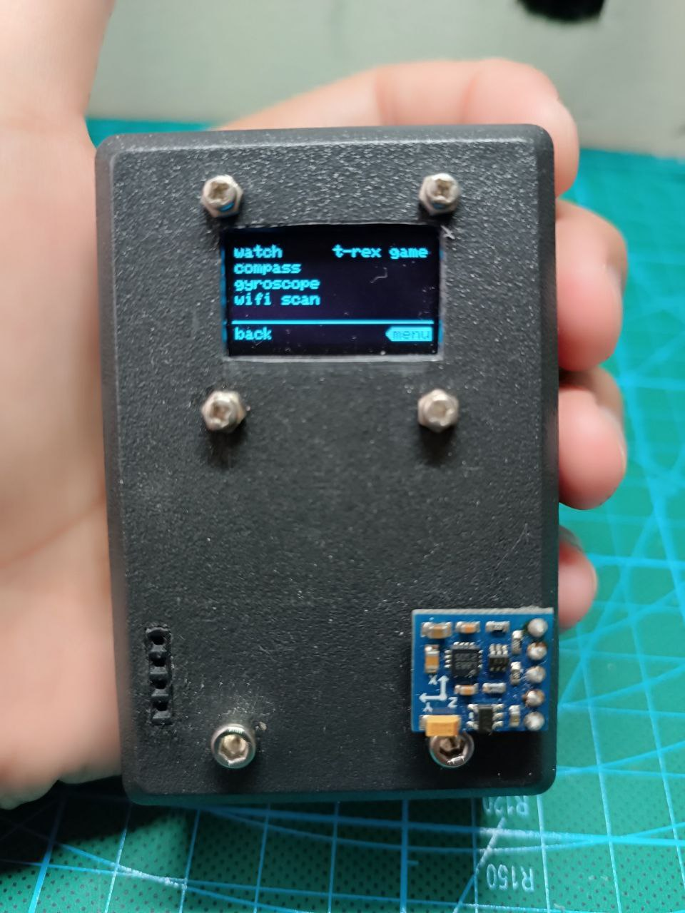
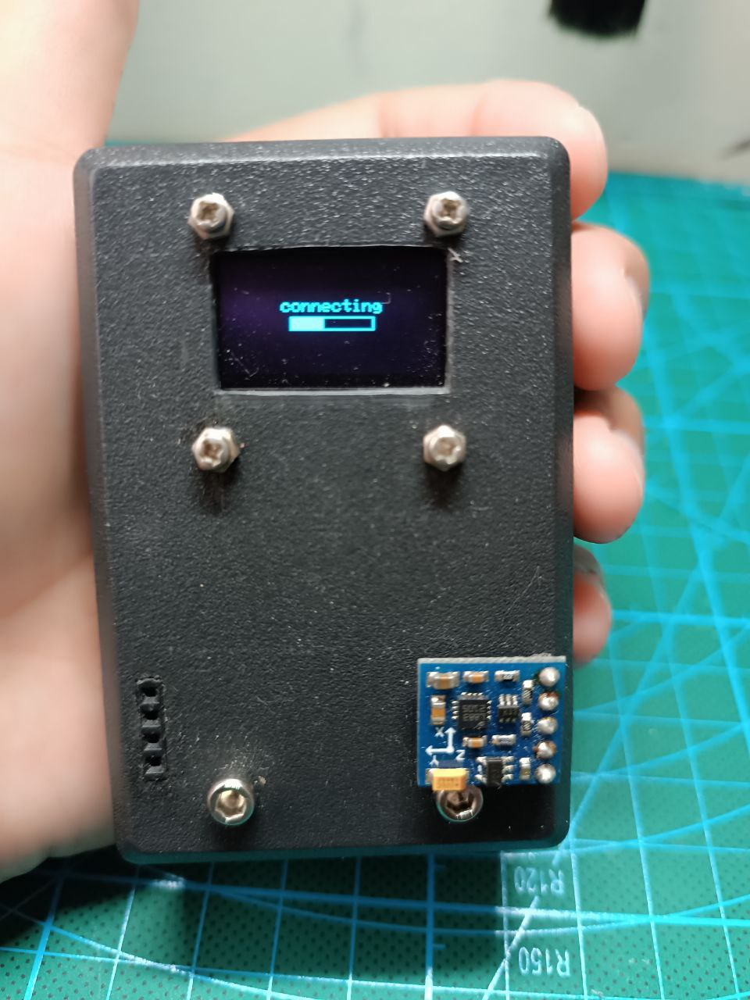
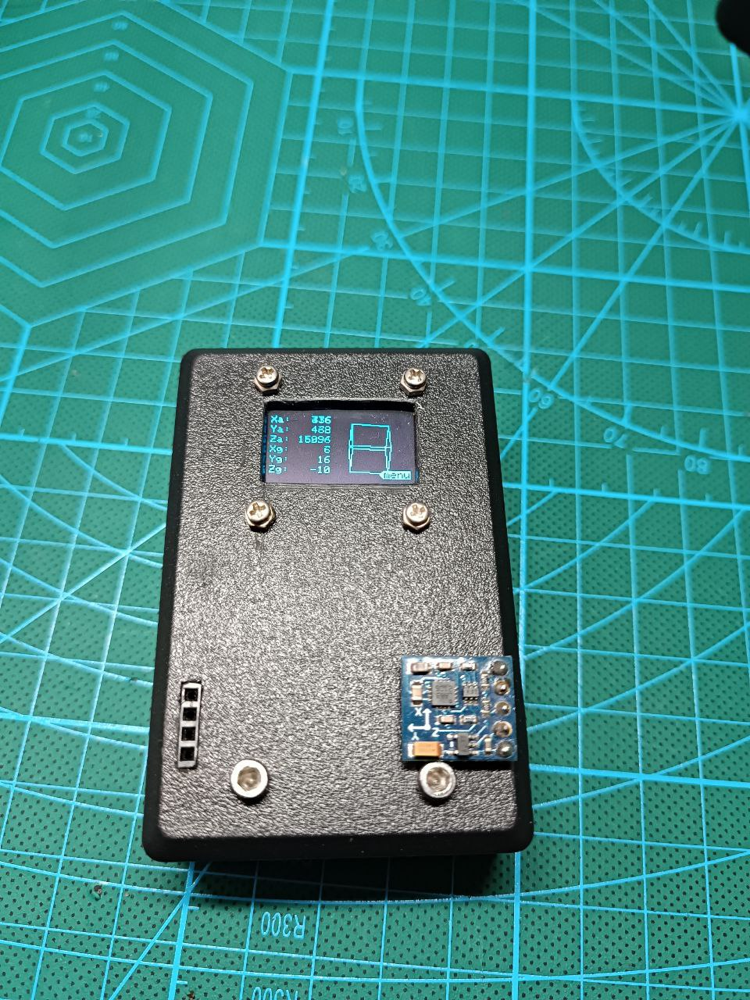
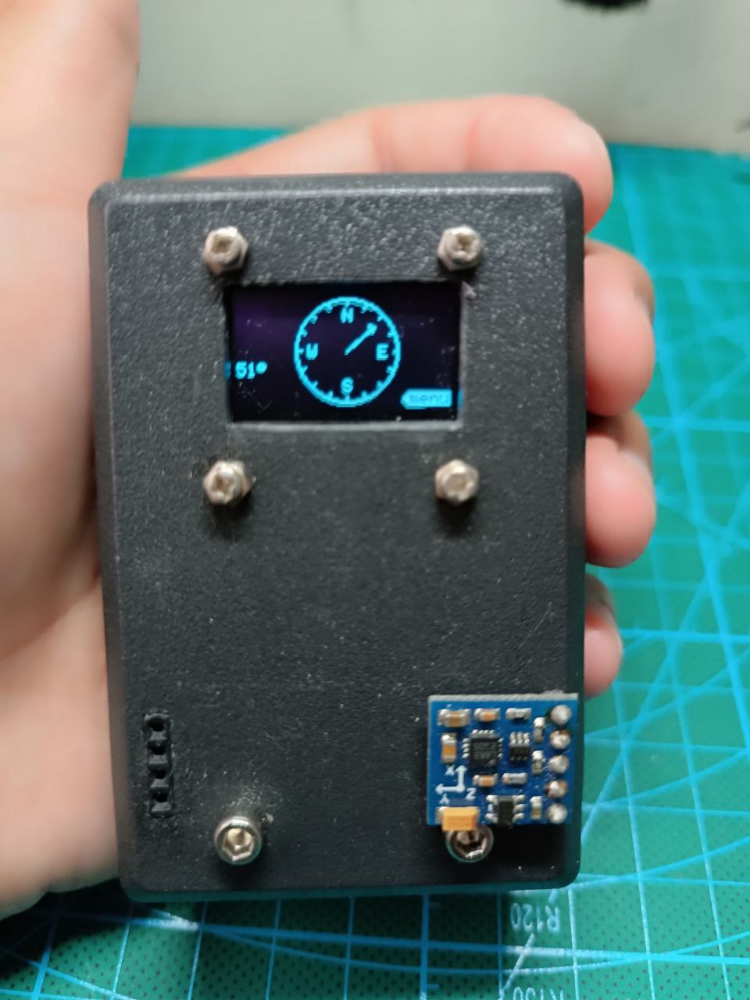
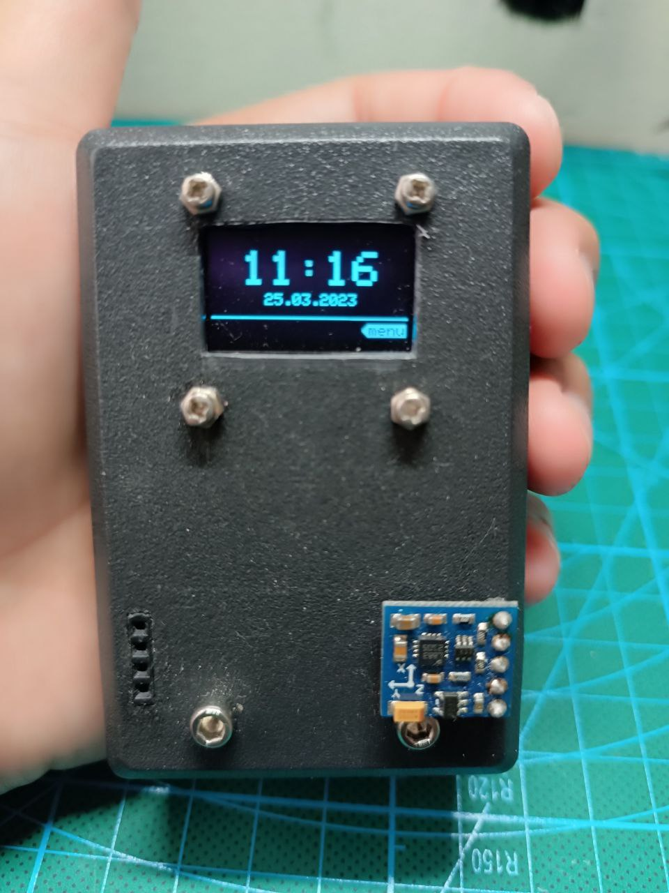
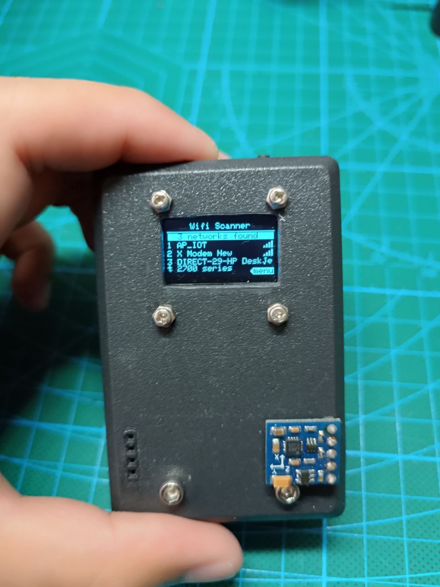
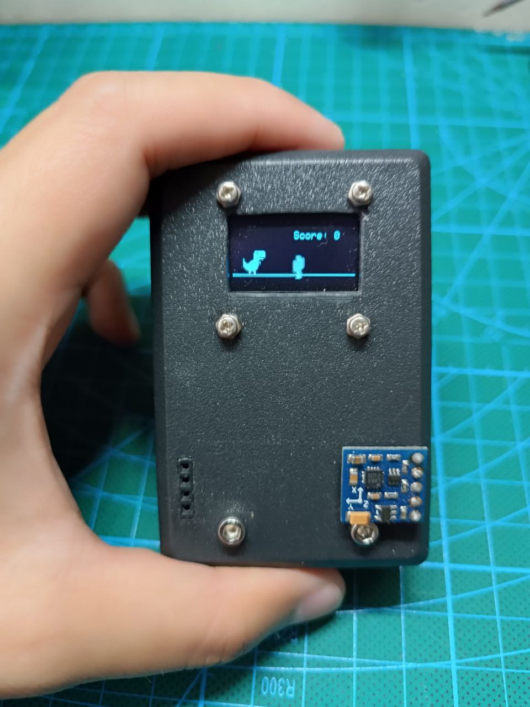

# FlipperX
Flipper Zero Clone using ESP8266

<table>
	<tr>
		<td><i>splash screen</i></td>
		<td><i>menu</i></td>
		<td><i>loading bar (connect wifi)</i></td>
	</tr>
	<tr>
		<td><i>orintation (gyro & accel)</i></td>
		<td><i>compas</i></td>
		<td><i>ntp clock</i></td>
	</tr>
	<tr>
		<td><i>wifi scanner</i></td>
		<td><i>t-rex game</i></td>
	</tr>
</table>
